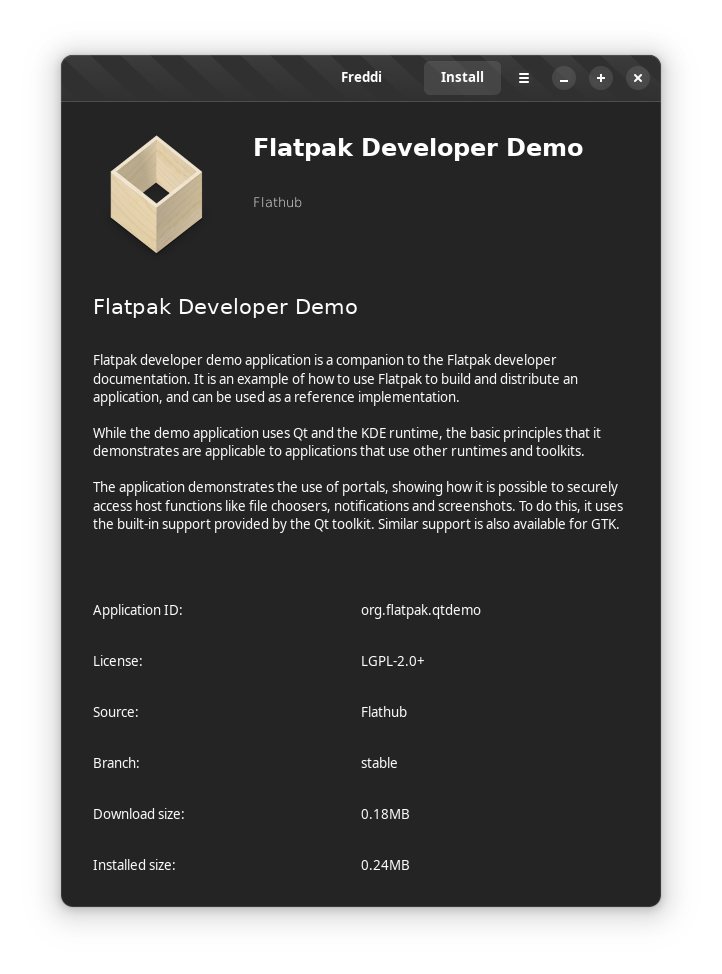

# About Freddi
A simple utility for installing flatpaks from a .flatpakref file.

Current state as of 11/09/2022:

Currently implemented:
* Displaying app metadata
* Installing applications

Doesn't work:
* Showing installation progress
* Showing that an app is already installed

This is a work in progress, and individual commits might be broken.

## Authors

This project is made by Yitzchak Schwarz.

## License

This project is licensed under GPL-2.0 only.